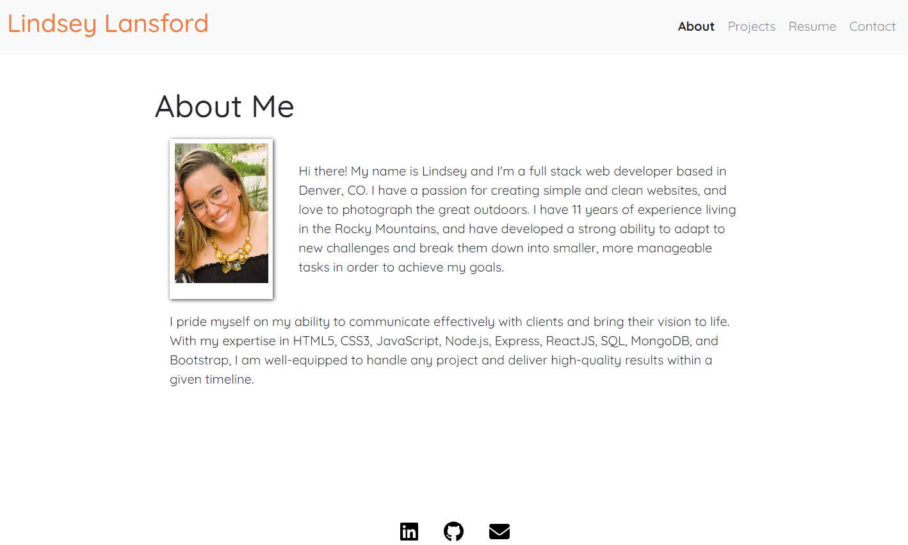

# React Portfolio

## Description

This application is a single-page, component based React portfolio. I used the npm package ```create-react-app``` to build the boiler plate template. For styling I used a bit of custom CSS, MaterialUI & Bootstrap. The app is written primarily in JavaScript.

## Table of Contents

  - [Description](#description)
  - [Mockup](#mockup)
  - [Deployed Link](#deployed-link)
  - [Questions](#questions)

## Mockup



## Deployed Link

[Click Here to view my portfolio.](https://lindsey-lansford.github.io/react-portfolio/)

## Questions

Please reach out with any questions you may have about this application.

* :octocat: GitHub: [@lindsey-lansford](https://github.com/lindsey-lansford)
* :envelope: Email: [lindsey.lansford@gmail.com](mailto:lindsey.lansford@gmail.com)
